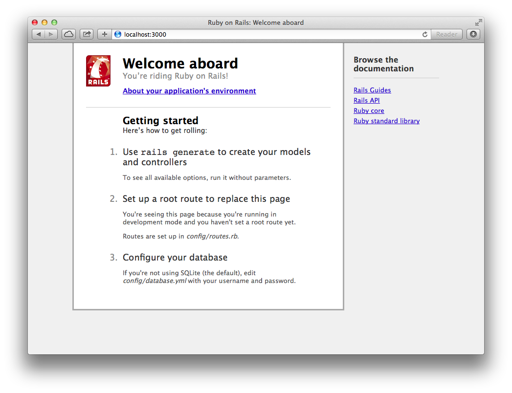

# How to Learn Ruby on Rails

## Welcome

People come into learning Rails for all sorts of reasons.  Whether you have been programming for years and want to give development in Ruby a try, or you are a complete coding newbie wanting to see if programming is for you, Rails is a great tool to learn.  Most of the resources in this guide assume no programming knowledge, so more advanced readers may choose to skim the introductory sections of each to learn the particulars of Ruby and Rails.

Before getting started, you should **pick a goal**.  These tutorials will walk you though creating sample applications, but the real test is when you apply the concepts to something unique.  This could be a personal blog, or a site for your dog walking business... whatever!  "Building a better Facebook" is probably a bit ambitious for a first project – keep it simple.  Having a real problem to solve in the back of your mind will help keep you motivated, and allow you to ask yourself "how would this apply to my project?" as you cover each concept.

### For beginners

It's [been said](http://en.wikipedia.org/wiki/Outliers_(book)) that it takes 10,000 hours of practice to master a skill, and programming is a particularly difficult one – if it were easy, there would be a lot more programmers in the world.  There's a quote

> Give someone a program, you frustrate them for a day; teach them how to program, you frustrate them for a lifetime.

Don't be discouraged if it isn't making sense.  There are [*tons* of resources](http://hackerhours.org/resources.html), online and in-person, that can help you get unstuck.

## Introduction

Rails is a framework written in Ruby that helps you build web applications.  There are a lot of concepts packed into that one sentence that may be new to you, but don't worry, we'll get you feeling cozy.

**Ruby** is a programming language.  While there are many others (e.g. Python and Java) and they can mostly accomplish the same tasks, Ruby is a particularly readable and fun one, so you've made a good choice.  If we were building a house, Ruby would be the raw materials: plywood, nails, etc.  **Rails** is a **framework** written in (and for) Ruby – think of this as the frame for the house.  It gives you certain parameters to work within, but you have a lot of flexibility about how the final product turns out.  Just like the frame is built from the same raw materials that will be used to fill in the details of the house, Rails is written in Ruby, and you will add all of your application-specific features using Ruby (and HTML, and CSS, etc.)

Through your instructions in Ruby, Rails will take information stored in a database and send HTML to be displayed to the user in a browser.  Let's get going!

## Installation

The first rite of passage of programming is getting the necessary tools installed.  Thankfully, there is a handy guide that describes how to do just that.

[Install Rails](http://installrails.com)

## Ruby

It's really tough to have a conversation if you don't speak the language, so Ruby is the next step on the way to building your first app.  Like most programming languages, Ruby is written in **source code** files as text, which is then run one of two ways:

* Interactively through the **REPL** (Read-Evaluate-Print Loop), which in Ruby is called **IRB**
* Run as **scripts**, i.e.

    ```bash
    $ ruby file.rb
    ```

One convention to note: when commands are shown with a `$` preceding them (like above), that means they are meant to be run at the command line.

Give these resources a try to learn the basics of programming in Ruby:

1. [Try Ruby](https://www.codeschool.com/courses/try-ruby)
1. [Ruby Bits](https://www.codeschool.com/courses/ruby-bits)

If you run into problems where you're not sure the state that your program is in, just remember: `puts` is your friend.  If you aren't sure what the value of a variable is at a certain line, just print it out to your console.

### Additional resources

* [Codecademy](http://www.codecademy.com/tracks/ruby)
* [Programming Ruby (the "Pickaxe" book)](http://pragprog.com/book/ruby/programming-ruby)

## Rails

Now that you have the basics down, you are ready for the main course: Rails!  [**Gems**](http://guides.rubygems.org) are reusable plugins that are published by the community, the most popular of which is Rails.  Rails itself is made up of many smaller gems.

As an example project, let's build a super simple classifieds site, where we can create and view individual listings.  We have a completed version available [here](https://github.com/Thinkful/thinklist/), and after each step will include:

* A link to the code as it should appear
* A link to the "diff" showing what changed

in case you get lost.

### Boilerplate

First, pick a **directory** (a.k.a. folder) where you want to put your code (you can move it later if you want).  Just as an example, let's create a `dev/` directory under our user folder:

```bash
$ mkdir ~/dev
$ cd ~/dev
```

**mkdir** creates the new folder under the home directory (which is what `~` refers to) – **cd** stands for "change directory", which takes us to that new spot.

Since we already have the Rails gem [installed](#installation), the next step is to generate a **boilerplate** application called "thinklist".  Run:

```bash
$ bin/rails new thinklist
$ cd thinklist
$ open .
```

* [Code](https://github.com/Thinkful/thinklist/tree/boilerplate)
* [Diff](https://github.com/Thinkful/thinklist/commit/c64b7ede55418bcf8e109a3162d35bed3ce8d633)

You will now see a bunch of folders and files – this is the skeleton of your Rails app.  To fire it up, run

```bash
$ bin/rails server
```

and open http://localhost:3000/ in your browser.  You should see something like this:



This means our **local** Rails **server** is successfully running on our computer.  Now let's look at the different pieces.

Note: some other Rails tutorials introduce **scaffolding** (via [`rails generate scaffold`](http://guides.rubyonrails.org/command_line.html#rails-generate)) to automatically write starter code for you, but we are going to take the manual approach for the sake of better understanding.  You'll thank us later.

### Models

**Models** are what deal with data in your application – they handle passing data to and from the **database** using **SQL**.  Think of a database as a bunch of interconnected spreadsheets, where each spreadsheet is called a **table**.  Models in Rails are built as gem called **ActiveRecord**.

### Views

**Views** are the part of Rails that generate HTML to be sent back to the browser.  In Rails, you use **ERB templates** to insert Ruby code into HTML files, so that you can generate pages depending on what record the user is viewing, whether they're logged in or not, etc.  **Helpers** are methods that can be used within your views, whether provided by Rails or written by you.

### Controllers

When you visit a Rails website, the request comes in through the **router**, which determines which **controller action** to send it to.  The controller then gathers up the models it needs, and **renders** the appropriate view.

### Assets

The page may need JavaScript, CSS, images, fonts, etc. in order to load, which Rails serves through the **asset pipeline**.

You will add **gem dependencies** to your app over time, which can be a pain to manage if you're adding each of them via `gem install`.  Rails uses a tool called [**Bundler**](http://bundler.io) to list the specific versions of gems that are required for an app, so installing all of them is as simple as running `bundle`.

### More Rails

Feel like you're ready to strike out on your own?  We didn't think so.  There are a *lot* of pieces to understand when building web applications, and chances are it was a bit of a blur the first time the concepts were introduced.  One piece of advice (c/o [Mattan Griffel](http://www.slideshare.net/mattangriffel/how-to-teach-yourself-to-code/70)): as soon as you get through one introduction to Rails, do another one.  The Rails Tutorial will focus on some additional topics, but even where they overlap, hearing the same thing explained two different ways will make it clearer.  Also, you will feel super awesome for already knowing a lot of it.  So, go ahead, and we'll see you back here soon.

[The Rails Tutorial](http://www.railstutorial.org)

## Deployment

Now that you've been led through building a basic Rails application, it's time to get it up in front of people.  When building an application, you will generally run it on your local machine, but for others to access the app, you need to **deploy** to a **server**.  The easiest and most popular option for hosting (new) Rails applications is [Heroku](https://www.heroku.com).  With some other providers, you need to set up the server, database, and other parts of the system, but with Heroku it can be as simple as running a few commands.  Follow [this guide](https://devcenter.heroku.com/articles/getting-started-with-rails4) to get your app live.

## Security

Your Rails application will likely have users, who will need to **authenticate** to your application.  This can happen via a simple username and password, or by doing **single-sign on** via Twitter, Facebook, etc.  Most authentication with 3rd-party services work through a process called [**OAuth**](http://oauth.net), though you'll generally use [an existing library](http://marcanguera.net/awesome-ruby/#awesome-ruby-authentication) to handle this for you.

Logged-in users might be able to do certain things that logged-out users can't, and an administrator might be able to see something that other users can't... this is called **authorization**.

## Going deeper

Congratulations!  You now understand all the fundamentals of building a web application in Rails.  There are many *many* options of what to learn next, and it's [turtles all the way down](http://en.wikipedia.org/wiki/Turtles_all_the_way_down).  Options include:

* SQL
* Front-end development
  * HTML/CSS
  * JavaScript (fundamentals, or a framework)
* More practice of programming fundamentals (algorithms, design patterns, etc.)
* Deeper understanding of Ruby
* Deeper understanding of Rails – see:
  * [Rails for Zombies](http://railsforzombies.org)
  * [Agile Web Development with Rails 4](http://pragprog.com/book/rails4/agile-web-development-with-rails-4)
  * [The Rails 4 Way](https://leanpub.com/tr4w)
* Working with APIs

There isn't a right (or wrong) choice, because their relative value will depend on your short and long-term goals.  Godspeed!
