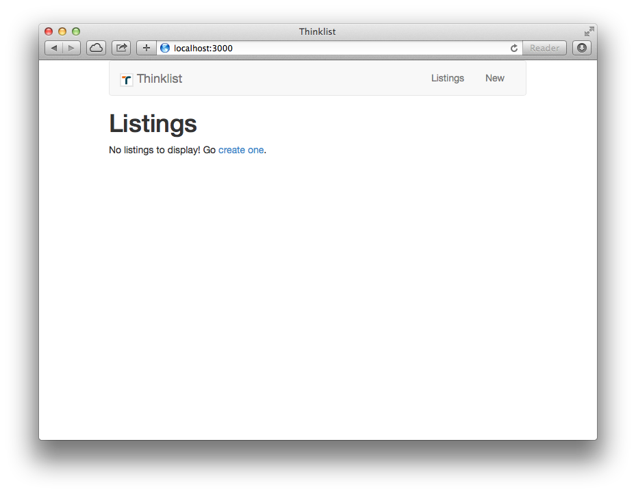

# How to Learn Ruby on Rails

## Welcome

People come into learning Rails for all sorts of reasons.  Whether you have been programming for years and want to give development in Ruby a try, or you are a complete coding newbie wanting to see if programming is for you, Rails is a great tool to learn.  Most of the resources in this guide assume no programming knowledge, so more advanced readers may choose to skim the introductory sections of each to learn the particulars of Ruby and Rails.

Before getting started, you should **pick a goal**.  These tutorials will walk you though creating sample applications, but the real test is when you apply the concepts to something unique.  This could be a personal blog, or a site for your dog walking business... whatever!  "Building a better Facebook" is probably a bit ambitious for a first project – keep it simple.  Having a real problem to solve in the back of your mind will help keep you motivated, and allow you to ask yourself "how would this apply to my project?" as you cover each concept.

### For beginners

It's [been said](http://en.wikipedia.org/wiki/Outliers_(book)) that it takes 10,000 hours of practice to master a skill, and programming is a particularly difficult one – if it were easy, there would be a lot more programmers in the world.  There's a quote

> Give someone a program, you frustrate them for a day; teach them how to program, you frustrate them for a lifetime.

Don't be discouraged if it isn't making sense.  There are [*tons* of resources](http://hackerhours.org/resources.html), online and in-person, that can help you get unstuck.

## Introduction

Rails is a framework written in Ruby that helps you build web applications.  There are a lot of concepts packed into that one sentence that may be new to you, but don't worry, we'll get you feeling cozy.

**Ruby** is a programming language.  While there are many others (e.g. Python and Java) and they can mostly accomplish the same tasks, Ruby is a particularly readable and fun one, so you've made a good choice.  If we were building a house, Ruby would be the raw materials: plywood, nails, etc.  **Rails** is a **framework** written in (and for) Ruby – think of this as the frame for the house.  It gives you certain parameters to work within, but you have a lot of flexibility about how the final product turns out.  Just like the frame is built from the same raw materials that will be used to fill in the details of the house, Rails is written in Ruby, and you will add all of your application-specific features using Ruby (and HTML, and CSS, etc.)

Through your instructions in Ruby, Rails will take information stored in a **database** and send **HTML** to be displayed to the user in a **browser**.  Let's get going!

## Installation

The first rite of passage of programming is getting the necessary tools installed.  Thankfully, there is a handy guide that describes how to do just that.

[Install Rails](http://installrails.com)

## Ruby

It's really tough to have a conversation if you don't speak the language, so Ruby is the next step on the way to building your first app.  Like most programming languages, Ruby is written in **source code** files as text, which is then run one of two ways:

* Interactively through the **REPL** (Read-Evaluate-Print Loop), which in Ruby is called **IRB**
* Run as **scripts**, i.e.

    ```bash
    $ ruby file.rb
    ```

One convention to note: lines that start with a `$` (like above) means they are commands, intended to be run at the command line.  Lines that start with `#` are comments, just there as helpful info.

Give these resources a try to learn the basics of programming in Ruby:

1. [Try Ruby](https://www.codeschool.com/courses/try-ruby)
1. [Ruby Bits](https://www.codeschool.com/courses/ruby-bits)

If you run into problems where you're not sure the state that your program is in, just remember: `puts` is your friend.  If you aren't sure what the value of a variable is at a certain line, just print it out to your console.

### Additional resources

* [Codecademy](http://www.codecademy.com/tracks/ruby)
* [Programming Ruby (the "Pickaxe" book)](http://pragprog.com/book/ruby/programming-ruby)

## Rails

Now that you have the basics down, you are ready for the main course: Rails!  [**Gems**](http://guides.rubygems.org) are reusable plugins that are published by the community, the most popular of which is Rails.  Rails itself is made up of many smaller gems.

### Sample Application

Let's start with a super simple classifieds site called Thinklist, where we can where we can create and view individual listings.  To get it set up, do the following:

1. [Download](https://github.com/Thinkful/thinklist/archive/start.zip) and unzip the starter application code
1. Open up your terminal
1. Navigate to the Thinklist **directory** (a.k.a folder) using the `cd` command (a.k.a. "change directory"), followed by the **path** (actual location may vary):

    ```bash
    $ cd ~/Downloads/thinklist-start
    ```

1. Install the app's dependencies using [**Bundler**](http://bundler.io):

    ```bash
    $ bundle
    ```

1. Set up the database:

    ```bash
    $ rake db:setup
    ```

1. Start the **server**:

    ```bash
    $ bin/rails server
    ```

1. Open the application in your browser: http://localhost:3000

You should now see something that looks like this:



### Adding On

The application is fairly simple, but play around with it a bit to get a feel for it.  We are going to use this application as a starting place, and learn some Rails by adding support for categories.  Don't worry if you get lost – after each step, we will include:

* A link to the code as it should appear
* A link to the "diff" showing what changed

Open up the folder in your [Sublime Text](http://www.sublimetext.com/) (or other code **editor** of choice) by dragging the folder onto the editor application icon.  You will now see a bunch of folders and files – these are the guts of your Rails app.  Let's get started!

### Migrations

In web applications, information is stored in a **database**.  Think of a database as a bunch of interconnected spreadsheets, called **tables**.  Take a look at the existing structure in [`db/schema.rb`](https://github.com/Thinkful/thinklist/blob/start/db/schema.rb).

In an application using a **SQL** database (like Thinklist), each type of thing (users, products, etc.) will generally have it's own table.  Let's get the category structure in place.

#### Generate

Use the Rails [`generate`](http://guides.rubyonrails.org/command_line.html#rails-generate) command to set up the [**migration**](http://guides.rubyonrails.org/migrations.html), which contains instructions for changes to the structure of the database.  Run:

```bash
$ bin/rails generate migration CreateCategories
```

* [Code](https://github.com/Thinkful/thinklist/tree/migration-generate)
* [Diff](https://github.com/Thinkful/thinklist/compare/start...migration-generate)

### Change

Open the newly created migration file, [`db/migrate/XXXXX_create_categories.rb`](https://github.com/Thinkful/thinklist/blob/migration-generate/db/migrate/20140911040047_create_categories.rb).  Here, we will need to specify exactly what we want changed, which in this case will be adding a `categories` table, as well as a reference (a.k.a. **foreign key**) from the `listings` so they can each be assigned a category.  Add this to the file:

```ruby
class CreateCategories < ActiveRecord::Migration
  def change
    create_table :categories do |t|
      t.string :name
      t.timestamps
    end

    add_reference :listings, :category
  end
end
```

* [Code](https://github.com/Thinkful/thinklist/tree/migration-change)
* [Diff](https://github.com/Thinkful/thinklist/compare/migration-generate...migration-change)

#### Run

Though the migration file has been generated, we now need to apply the change.  [**Rake**](https://github.com/jimweirich/rake) is another gem that lots of Rails-related commands are run through.

```bash
$ bin/rake db:migrate
```

Assuming the migration was successful, you will see the changes reflected in [`db/schema.rb`](https://github.com/Thinkful/thinklist/blob/migration-run/db/schema.rb).

* [Code](https://github.com/Thinkful/thinklist/tree/migration-run)
* [Diff](https://github.com/Thinkful/thinklist/compare/migration-change...migration-run)

### Models

**Models** are what deal with data in your application – they handle passing information to and from the database.  You can see our (currently very simple) model definition for Listings in [`app/models/listing.rb`](https://github.com/Thinkful/thinklist/blob/start/app/models/listing.rb).

Now that we have the database structure in place for categories, we need to create a corresponding model.  The file and class name are the singular form of the table name (`categories`), and are **case-sensitive**.

```ruby
# app/models/category.rb
class Category < ActiveRecord::Base
  has_many :listings, dependent: :nullify
end
```

Models in Rails are built on top of a gem called [**ActiveRecord**](http://guides.rubyonrails.org/active_record_basics.html), so you will notice that your `Category` model **inherits** (the `<` part) from [`ActiveRecord::Base`](http://api.rubyonrails.org/classes/ActiveRecord/Base.html).  The [`has_many`](http://guides.rubyonrails.org/association_basics.html#the-has-many-association) line tells Rails that there is a relationship (a.k.a. [**association**](http://guides.rubyonrails.org/association_basics.html)) between the listings and the categories.

* [Code](https://github.com/Thinkful/thinklist/tree/model)
* [Diff](https://github.com/Thinkful/thinklist/compare/migration-run...model)

Now let's set up the other half of the relation:

```ruby
# app/models/listing.rb
class Listing < ActiveRecord::Base
  belongs_to :category

  # ...
end
```

This tells Rails that `Listing`s can be assigned a category.  `has_many` with a `belongs_to` is called a **one-to-many relationship**, because one Category can have many Listings, but a Listing can have at most one Category.

* [Code](https://github.com/Thinkful/thinklist/tree/belongs-to)
* [Diff](https://github.com/Thinkful/thinklist/compare/model...belongs-to)

### Console

The easiest way to understand how models work are to interact with them in the Rails **console**. The console is IRB (which we've already seen), but you are able to make calls to your Rails application code. To open it, run:

```
$ bin/rails console
>>
```

At this new prompt, type the following, then press ENTER to execute the line:

```ruby
Category.count
```

As expected, none exist yet. Let's [create](http://guides.rubyonrails.org/active_record_basics.html#create) one:

```ruby
Category.create(name: "Antiques")
```

Both `#count` and `#create` are **class methods** provided by ActiveRecord, but we can interact with individual **instances**/categories as well:

```ruby
Category.count
category = Category.last
category.name
category.created_at
```

When done, type `exit` and press ENTER to quit the Rails console.

### Views

**Views** are the part of Rails that generate HTML to be sent back to the browser.  In Rails, you use **ERB templates** to insert Ruby code into HTML files, so that you can generate pages depending on what record the user is viewing, whether they're logged in or not, etc.  **Helpers** are methods that can be used within your views, whether provided by Rails or written by you.

### Controllers

When you visit a Rails website, the request comes in through the **router**, which determines which **controller action** to send it to.  The controller then gathers up the models it needs, and **renders** the appropriate view.

### Forms

We want the ability to assign a category to a listing. Visit [the form](http://localhost:3000/listings/new) for creating new listings. Let's use the Rails [form helpers](http://guides.rubyonrails.org/form_helpers.html) to add a dropdown/`<select>` box to the form next to the other fields for the user to choose the category:

```erb
<!-- app/views/listings/_form.html.erb -->

<div class="form-group">
  <%= f.label :category %>
  <%= f.collection_select :category_id, Category.all, :id, :name, { include_blank: "Please select..." }, { class: 'form-control' } %>
</div>
```

* [Code](https://github.com/Thinkful/thinklist/tree/select)
* [Diff](https://github.com/Thinkful/thinklist/compare/belongs-to...select)

Refresh the page, and you should see the new field present. Select a category and create a new listing. Did you get an error? This is because, for [security reasons](http://weblog.rubyonrails.org/2012/3/21/strong-parameters/), Rails requires us to explicitly tell it what fields should be coming in from the form. Let's add `:category_id` to the list of accepted **parameters**:

```ruby
# bottom of app/controllers/listings_controller.rb
def listing_params
  params.require(:listing).permit(:title, :description, :price, :category_id)
end
```

Try creating another listing with a category, and it should save successfully.

### Assets

The page may need JavaScript, CSS, images, fonts, etc. in order to load, which Rails serves through the **asset pipeline**.

You will add **gem dependencies** to your app over time, which can be a pain to manage if you're adding each of them via `gem install`.  Rails uses a tool called [**Bundler**](http://bundler.io) to list the specific versions of gems that are required for an app, so installing all of them is as simple as running `bundle`.

### More Rails

Feel like you're ready to strike out on your own?  We didn't think so.  There are a *lot* of pieces to understand when building web applications, and chances are it was a bit of a blur the first time the concepts were introduced.  One piece of advice (c/o [Mattan Griffel](http://www.slideshare.net/mattangriffel/how-to-teach-yourself-to-code/70)): as soon as you get through one introduction to Rails, do another one.  The Rails Tutorial will focus on some additional topics, but even where they overlap, hearing the same thing explained two different ways will make it clearer.  Also, you will feel super awesome for already knowing a lot of it.  So, go ahead, and we'll see you back here soon.

[The Rails Tutorial](http://www.railstutorial.org)

## Deployment

Now that you've been led through building a basic Rails application, it's time to get it up in front of people.  When building an application, you will generally run it on your local machine, but for others to access the app, you need to **deploy** to a **server**.  The easiest and most popular option for hosting (new) Rails applications is [Heroku](https://www.heroku.com).  With some other providers, you need to set up the server, database, and other parts of the system, but with Heroku it can be as simple as running a few commands.  Follow [this guide](https://devcenter.heroku.com/articles/getting-started-with-rails4) to get your app live.

## Security

Your Rails application will likely have users, who will need to **authenticate** to your application.  This can happen via a simple username and password, or by doing **single-sign on** via Twitter, Facebook, etc.  Most authentication with 3rd-party services work through a process called [**OAuth**](http://oauth.net), though you'll generally use [an existing library](http://marcanguera.net/awesome-ruby/#awesome-ruby-authentication) to handle this for you.

Logged-in users might be able to do certain things that logged-out users can't, and an administrator might be able to see something that other users can't... this is called **authorization**.

## Going deeper

Congratulations!  You now understand all the fundamentals of building a web application in Rails.  There are many *many* options of what to learn next, and it's [turtles all the way down](http://en.wikipedia.org/wiki/Turtles_all_the_way_down).  Options include:

* SQL
* Front-end development
  * HTML/CSS
  * JavaScript (fundamentals, or a framework)
* More practice of programming fundamentals (algorithms, design patterns, etc.)
* Deeper understanding of Ruby
* Deeper understanding of Rails – see:
  * [Rails for Zombies](http://railsforzombies.org)
  * [Agile Web Development with Rails 4](http://pragprog.com/book/rails4/agile-web-development-with-rails-4)
  * [The Rails 4 Way](https://leanpub.com/tr4w)
* Working with APIs

There isn't a right (or wrong) choice, because their relative value will depend on your short and long-term goals.  Godspeed!
